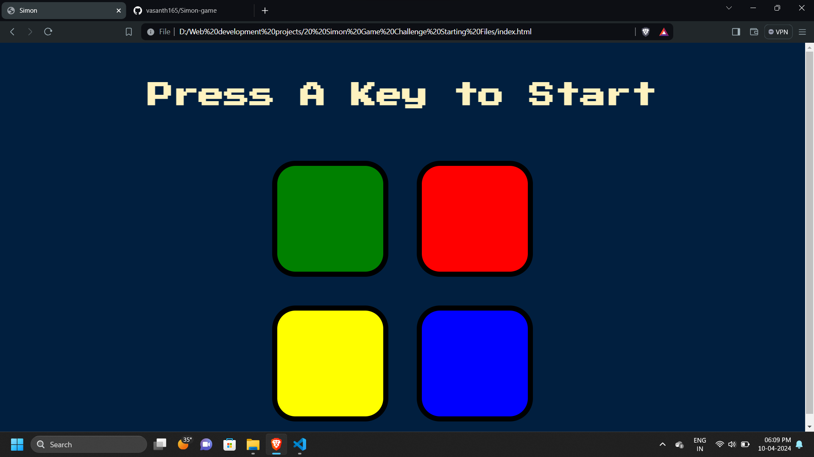

# Simon Game

This is a Simon game implemented using HTML, CSS, and JavaScript. Simon is a memory game where the player must repeat a sequence of colors and sounds in the same order that the game presents them. The game starts with a sequence of one color, and after the player reproduces the sequence correctly, it extends the sequence by one more color. The game continues indefinitely until the player makes a mistake.

## How to Play

1. **Start:** Press any key to start the game.
2. **Gameplay:** Remember the sequence of colors and their order that Simon presents.
3. **Repeat:** Click or tap on the colors in the same order that Simon presented them.
4. **Winning:** If you repeat the sequence correctly, the level increases by one, and a new sequence is presented.
5. **Losing:** If you make a mistake, the game ends, and it displays "Game Over. Press Any Key to Restart."

## Features

- Simon game implementation with HTML, CSS, and JavaScript.
- Increasing difficulty level as the player progresses.
- Simple and intuitive user interface.

## Preview

## Play the Game

You can play the game [here](https://vasanth165.github.io/Simon-game/).

simon-game
